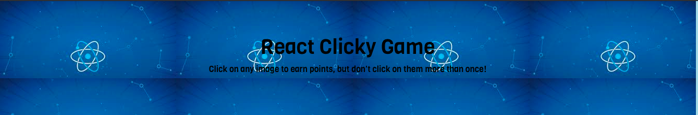
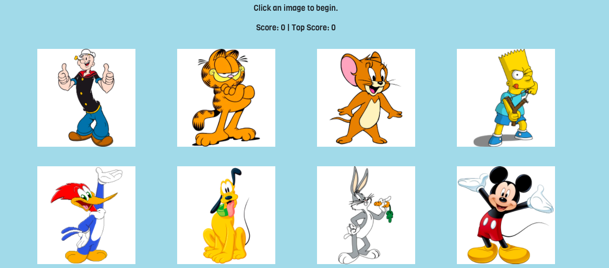
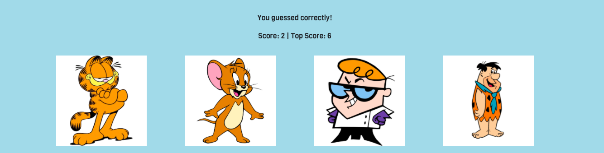

# clicky-homework-gameOverview
**Objective**

A Cartoone based memory game that uses React to update and moniter the state of the page.

**How to Play**
First click this link[game](https://www.example.com)  take you to the deployed application. Scroll down to the images and click! Then just follow the prompts until an incorrect guess, after that start all over again!

**Technologies used**
* Reactjs
* Bootstrap

**Contributers**
Noe Hernandez - Developer

